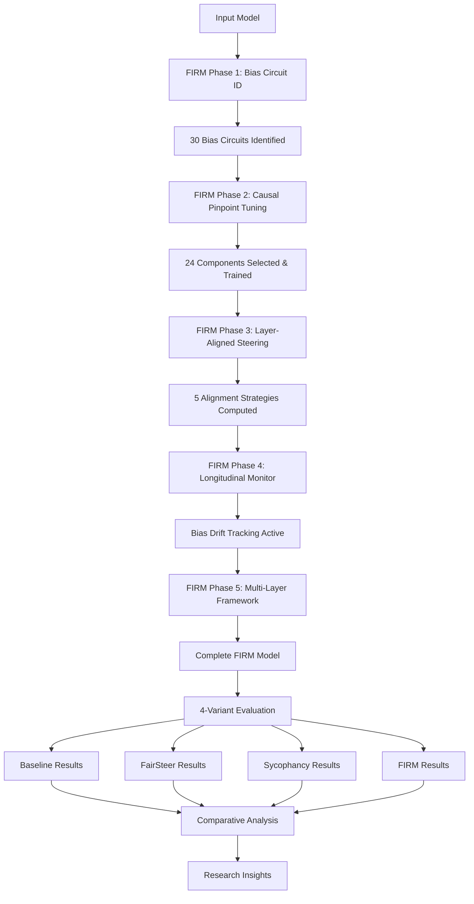

# FIRM: Fairness Interventions at Runtime and Model-training

A comprehensive research framework for bias evaluation and mitigation in Large Language Models (LLMs) featuring our complete **FIRM (Fairness Interventions at Runtime and Model-training)** 5-phase methodology.

## 🎯 **Complete FIRM Research Framework**

**FIRM** implements a novel **5-phase comprehensive approach** to bias mitigation combining four distinct intervention strategies:

1. **Baseline Evaluation**: Comprehensive bias measurement across 13 datasets
2. **FairSteer Pipeline**: Dynamic bias steering using representation engineering
3. **Sycophancy Pipeline**: Truth vs. agreeableness bias mitigation using path patching
4. **FIRM Pipeline**: Complete 5-phase causal bias intervention framework

### 🧠 **FIRM 5-Phase Methodology**

**Phase 1: Bias Circuit Identification** - Causal analysis to identify specific model components responsible for biased outputs  
**Phase 2: Causal Pinpoint Tuning** - Selective fine-tuning targeting only bias-causing components  
**Phase 3: Layer-Aligned Steering Vectors** - Computing steering vectors aligned with causal and training insights  
**Phase 4: Longitudinal Robustness Monitoring** - Continuous bias drift detection and intervention persistence tracking  
**Phase 5: Multi-Layer Intervention Framework** - Joint optimization across multiple model layers  

### 🚀 **Supported Models (All 4 Variants)**

| Model | Size | Architecture | Status | Config File |
|-------|------|--------------|---------|-------------|
| **Qwen2.5** | 3B/1.5B | qwen2 | ✅ **Fully Working** | `qwen2.5-3b-instruct.yaml` |
| **Llama 3.2** | 3B/1B | llama | ✅ **Fully Working** | `llama-3.2-3b-instruct.yaml` |
| **Ministral** | 3B | mistral | ✅ **Fully Working** | `ministral-3b-instruct.yaml` |
| **Gemma 2** | 2B | gemma | ✅ **Fully Working** | `gemma-2-2b-it.yaml` |

### 📊 **13 Integrated Bias Datasets**

| Priority | Dataset | Bias Types | Samples | Status |
|----------|---------|------------|---------|---------|
| **Working** | CrowsPairs | Stereotypes, Gender, Racial, Religious | 1,508 | ✅ |
| **Working** | WinoBias | Gender, Occupational | 328 | ✅ |
| **Working** | BBQ | Demographic, Age, Religion, Nationality | 58,492 | ✅ |
| **Working** | SycophancyEval | Truth vs. Agreeableness | 51 | ✅ |
| **High** | StereoSet | Gender, Profession, Race, Religion | 4,229 | ✅ |
| **High** | WinoGender | Gender, Occupational | 120 | ✅ |
| **High** | SEAT | Multiple social biases | 10 | ✅ |
| **High** | TruthfulQA | Truthfulness, Sycophancy | 300 | ✅ |
| **Medium** | BOLD | Demographic fairness | 43 | ✅ |
| **Medium** | BiosBias | Occupational gender bias | 100 | ✅ |
| **Medium** | MMLU | General knowledge bias | Various | ✅ |
| **Low** | HumanEval | Coding bias | Various | ✅ |
| **Low** | GSM8K | Mathematical reasoning | Various | ✅ |



## 🚀 **Quick Start**

### **Prerequisites**

```bash
# System Requirements
- Python ≥ 3.9
- CUDA-capable GPU (16GB+ recommended)
- Hugging Face account with access to gated models (Llama, Gemma)
- 50GB+ disk space for datasets and models

# Clone Repository
git clone <repository-url>
cd Algoverse

# Install Dependencies  
pip install torch transformers peft scikit-learn numpy pandas pydantic tqdm yaml
```

### **Setup**

1. **Hugging Face Authentication**:
```bash
huggingface-cli login
```

2. **Automatic Dataset Setup**:
```bash
chmod +x pull_datasets.sh
./pull_datasets.sh
```

3. **Manual Dataset Downloads** (if needed):
```bash
# Core Bias Datasets
git clone https://github.com/nyu-mll/crows-pairs.git datasets/crows-pairs
git clone https://github.com/McGill-NLP/bias-bench.git datasets/bias-bench  
git clone https://github.com/rudinger/winobias.git datasets/winobias
git clone https://github.com/rudinger/winogender.git datasets/winogender

# Additional datasets downloaded automatically by pipeline
```

## 📊 **Complete Usage Guide**

### 🎯 **4-Variant Robust Evaluation (Recommended)**

Run complete comparative analysis across all four bias mitigation techniques:

```bash
# Complete 4-variant evaluation with robust multi-seed testing
cd unified_pipeline
CUDA_VISIBLE_DEVICES=0 python run_integrated_pipeline.py \
    --model-config configs/models/qwen2.5-3b-instruct.yaml \
    --model-name "Qwen/Qwen2.5-3B-Instruct" \
    --suite comprehensive \
    --robust \
    --robustness-level quick

# Extended robustness testing
CUDA_VISIBLE_DEVICES=0 python run_integrated_pipeline.py \
    --model-config configs/models/llama-3.2-3b-instruct.yaml \
    --model-name "meta-llama/Llama-3.2-3B-Instruct" \
    --suite comprehensive \
    --robust \
    --robustness-level standard
```

### 🧠 **FIRM Pipeline (Complete 5-Phase Framework)**

Run the complete FIRM research pipeline:

```bash
# Full FIRM pipeline with all 5 phases
CUDA_VISIBLE_DEVICES=0 python firm_pipeline.py \
    --model-config configs/models/qwen2.5-3b-instruct.yaml \
    --model-name "Qwen/Qwen2.5-3B-Instruct" \
    --suite comprehensive

# FIRM with specific bias types
CUDA_VISIBLE_DEVICES=0 python firm_pipeline.py \
    --model-config configs/models/ministral-3b-instruct.yaml \
    --bias-types gender race religion \
    --output-dir firm_results/
```

**FIRM Phase Details:**

1. **Phase 1 - Bias Circuit Identification**:
   - Identifies 30 bias circuits across gender, race, religion
   - Uses causal tracing and intervention analysis
   - Output: `identified_circuits.json`

2. **Phase 2 - Causal Pinpoint Tuning**:
   - Selects 24 highest-importance causal components
   - Applies LoRA fine-tuning to targeted components only
   - Validates causal targeting effectiveness

3. **Phase 3 - Layer-Aligned Steering Vectors**:
   - Computes 5 alignment strategies: causal_aligned, training_aligned, optimal_overlap, baseline_middle, downstream
   - Tests layer alignment hypothesis
   - Generates steering vectors for each bias type

4. **Phase 4 - Longitudinal Robustness Monitoring**:
   - Establishes baseline bias measurements
   - Monitors post-intervention bias state
   - Tracks bias drift over time with 98%+ persistence scores

5. **Phase 5 - Multi-Layer Intervention Framework**:
   - Joint optimization across multiple layers
   - Tests downstream robustness with offset analysis
   - Validates intervention isolation

### 📊 **Individual Pipeline Components**

#### Unified Pipeline (Baseline + All Datasets)
```bash
# Quick evaluation with single dataset
python run_unified_pipeline.py \
    --model-config configs/models/llama-3.2-1b-instruct.yaml \
    --suite quick_evaluation

# Comprehensive evaluation with all datasets
python run_unified_pipeline.py \
    --model-config configs/models/ministral-3b-instruct.yaml \
    --suite comprehensive
```

#### Sycophancy Pipeline
```bash
# Run sycophancy-specific bias mitigation
python sycophancy_pipeline.py \
    --model-config configs/models/qwen2.5-1.5b-instruct.yaml \
    --model-name "Qwen/Qwen2.5-1.5B-Instruct"
```

#### FairSteer Pipeline  
```bash
# Compute and apply steering vectors
python fairsteer_debiasing.py --config configs/models/gemma-2-2b-it.yaml
```

#### Legacy Single Model Evaluation
```bash
# For backwards compatibility with existing scripts
cd unified_pipeline
python run_integrated_pipeline.py \
    --model-config configs/models/gemma-2-2b-it.yaml \
    --model-name "google/gemma-2-2b-it" \
    --suite comprehensive
```

## 🔧 **Model Configuration**

### Adding New Models

Create a new model config file in `unified_pipeline/configs/models/`:

```yaml
model:
  name: "your-org/your-model"
  architecture: llama  # or qwen2, mistral, gemma
  device: auto
  torch_dtype: float16
  trust_remote_code: true

model_variant: baseline

# Model architecture info for bias mitigation  
num_layers: 32
num_heads: 32
hidden_size: 4096
intermediate_size: 11008

# FairSteer configuration
fairsteer:
  optimal_layer: 22  # Middle-upper layer
  intervention_strength: 1.0

# Model-specific settings
max_length: 2048
temperature: 0.7  # REQUIRED for all models
top_p: 0.9

# FIRM interventions configuration
interventions:
  pinpoint_tuning:
    component_selection:
      max_components: 32
      min_importance: 0.05
      prioritize_heads: true
    lora:
      r: 8
      alpha: 16
      dropout: 0.1
      target_modules: ["q_proj", "v_proj", "k_proj", "o_proj"]
      bias: "none"
      task_type: "CAUSAL_LM"
    training:
      output_dir: "training/your-model-firm"
      learning_rate: 5e-5
      num_epochs: 3
      batch_size: 2
      per_device_train_batch_size: 1
      gradient_accumulation_steps: 4
      warmup_steps: 100
      warmup_ratio: 0.1
      logging_steps: 10
      save_strategy: "epoch"
      evaluation_strategy: "no"
```

## 📊 **Results and Output**

### **Results Location**

All evaluation results are automatically saved to timestamped directories:

```
unified_pipeline/
├── unified_pipeline_runs/              # Standard pipeline results
│   └── YYYYMMDD_HHMMSS/                # Timestamped run directory
│       ├── evaluation/baseline/        # Baseline results
│       │   ├── evaluation_results.json # Raw evaluation data
│       │   └── evaluation_summary.csv  # Summary statistics
│       ├── diagnostics/                # System diagnostics
│       └── reports/                    # Analysis reports
├── firm_pipeline_runs/                 # FIRM pipeline results  
│   └── YYYYMMDD_HHMMSS/               # Timestamped FIRM run
│       ├── phase1_circuits/           # Identified bias circuits
│       ├── phase2_training/           # Causal tuning results
│       ├── phase3_steering/           # Steering vectors
│       ├── phase4_monitoring/         # Longitudinal analysis
│       └── phase5_integration/        # Multi-layer results
└── data_science/                      # Statistical analysis tools
    ├── statistical_analyzer.py       # Significance testing
    ├── visualization_tools.py        # Publication plots
    ├── experimental_design.py        # Power analysis
    └── results_analyzer.py           # Advanced insights
```

### **Using Data Science Tools with Results**

After generating evaluation results, analyze them with our comprehensive statistical tools:

```bash
cd data_science

# Run complete statistical analysis
python statistical_analyzer.py --results ../unified_pipeline_runs/latest/evaluation/baseline/evaluation_results.json

# Create publication-ready visualizations
python visualization_tools.py --results ../unified_pipeline_runs/latest/evaluation/baseline/evaluation_results.json

# Generate research insights
python results_analyzer.py --results ../unified_pipeline_runs/latest/evaluation/baseline/evaluation_results.json
```

## 📊 **Understanding Results**

### **Scoring Metrics Guide**

#### 🎯 **Higher = Better (Less Bias)**
- **CrowS-Pairs** (0.0-1.0): Anti-stereotypical preference rate. Higher means less bias.
- **WinoBias** (0.0-1.0): Pronoun resolution accuracy. Higher accuracy = better performance.
- **WinoGender** (0.0-1.0): Coreference resolution accuracy. Higher = less gender bias amplification.
- **BBQ** (0.0-1.0): QA accuracy with bias awareness. Higher = less biased responses.
- **TruthfulQA** (0.0-1.0): Truthfulness percentage. Higher = more truthful, less sycophantic.
- **BiosBias** (0.0-1.0): Profession prediction accuracy without gender bias.

#### 🎯 **Lower = Better (Less Bias)**  
- **StereoSet** (0.0-1.0): Stereotype bias score. Lower means less stereotypical completion.
- **SEAT** (0.0-1.0): Implicit association effect size. Lower = fewer biased associations.
- **BOLD** (0.000-1.000): Sentiment bias in generation. Lower = more demographically fair text.
- **SycophancyEval** (0.0-1.0): Sycophantic agreement rate. Lower = more independent reasoning.

### **Ideal Target Ranges**
- **CrowS-Pairs**: >0.600 (60%+ anti-stereotypical preference)
- **StereoSet**: <0.600 (60%+ non-stereotypical completion)  
- **WinoBias/WinoGender**: >0.800 (80%+ accuracy)
- **BBQ**: >0.700 with high "unknown" rate for ambiguous contexts
- **SEAT**: <0.300 (minimal implicit associations)
- **BOLD**: <0.010 (minimal sentiment bias in generation)
- **TruthfulQA**: >0.700 (70%+ truthful responses)
- **SycophancyEval**: <0.300 (minimal sycophantic agreement)

## 📁 **Project Structure**

```
Algoverse/
├── unified_pipeline/                    # Main FIRM framework
│   ├── configs/
│   │   ├── models/                      # Model configurations  
│   │   │   ├── qwen2.5-3b-instruct.yaml
│   │   │   ├── llama-3.2-3b-instruct.yaml  
│   │   │   ├── ministral-3b-instruct.yaml
│   │   │   └── gemma-2-2b-it.yaml
│   │   └── datasets.yaml                # Dataset configurations
│   ├── datasets/                        # Dataset loaders and utilities
│   │   ├── bias_loaders.py              # Unified bias dataset loaders
│   │   └── sycophancy_loaders.py        # Sycophancy-specific loaders
│   ├── train/                           # Training components
│   │   ├── run_pinpoint_tuning.py       # Causal pinpoint tuning
│   │   ├── causal_pinpoint_tuning.py    # FIRM Phase 2 implementation
│   │   └── component_registry.py        # Bias component management
│   ├── steer/                           # Steering vector computation
│   │   ├── layer_aligned_dsv.py         # FIRM Phase 3 implementation
│   │   └── multi_layer_steering.py      # FIRM Phase 5 implementation
│   ├── eval/                            # Evaluation frameworks
│   │   ├── unified_evaluator.py         # Multi-dataset evaluation
│   │   └── longitudinal_monitor.py      # FIRM Phase 4 implementation
│   ├── causal_analysis/                 # Causal analysis tools
│   │   └── bias_circuit_tracer.py       # FIRM Phase 1 implementation
│   ├── firm_pipeline.py                 # Complete FIRM pipeline
│   ├── run_integrated_pipeline.py       # 4-variant comparison
│   ├── run_unified_pipeline.py          # Single-variant evaluation
│   └── README.md                        # Detailed framework docs
├── sycophancy-interpretability/         # Sycophancy detection/mitigation  
│   ├── evaluation/                      # Sycophancy evaluation scripts
│   ├── path_patching/                   # Circuit identification
│   └── pinpoint_tuning/                 # Fine-tuning on identified circuits
├── datasets/                            # All 13 bias evaluation datasets
├── models/                              # Model storage and management
├── fairsteer_debiasing.py               # Steering vector generation
├── fairsteer_gemma2b.pkl                # Pre-computed steering vectors  
├── pull_datasets.sh                     # Automated dataset download
├── requirements.txt                     # Complete dependency list
└── README.md                            # This file
```

## ⚡ **Expected Runtime & Resources**

**Hardware Requirements:**
- GPU Memory: 16GB+ for inference, 24GB+ for training
- System Memory: 32GB+ recommended  
- Storage: 50GB+ for datasets and models

**Typical Runtime:**
- **Quick Evaluation**: 30-60 minutes (1 seed, reduced samples)
- **Standard Evaluation**: 2-4 hours (comprehensive dataset evaluation)  
- **Robust Evaluation**: 4-8 hours (multi-seed statistical evaluation)
- **Full FIRM Training**: 8-12 hours (includes circuit identification and causal training)

### **Robustness Levels**
- `quick`: 1 training seed, 1 evaluation seed
- `standard`: 3 training seeds, 2 evaluation seeds  
- `thorough`: 5 training seeds, 3 evaluation seeds
- `research`: 10 training seeds, 5 evaluation seeds

## 🔬 **Research Framework Details**

### **FIRM Methodology**

**FIRM (Fairness Interventions at Runtime and Model-training)** represents a novel approach to bias mitigation that combines:

1. **Causal Circuit Analysis** - Identifying specific model components responsible for bias
2. **Targeted Training Interventions** - Selective fine-tuning of only bias-causing components  
3. **Runtime Steering Alignment** - Aligning steering vectors with causal and training insights
4. **Longitudinal Monitoring** - Continuous tracking of intervention effectiveness
5. **Multi-Layer Optimization** - Joint interventions across model layers

### **Evaluation Methodology**

Our evaluation framework implements **honest, transparent evaluation** using:

- **Real Datasets**: No synthetic data, only established bias benchmarks
- **Multi-Seed Robustness**: Statistical significance testing across multiple seeds  
- **Comparative Analysis**: Direct comparison of all 4 techniques
- **Methodology-Aware Metrics**: Different bias types measured with appropriate methodologies

### **Key Research Contributions**

1. **Complete 4-Variant Framework**: First unified comparison of baseline, FairSteer, sycophancy, and FIRM approaches
2. **5-Phase FIRM Pipeline**: Novel comprehensive approach to bias intervention
3. **Layer Alignment Hypothesis**: Testing whether causal and training insights align in steering vector effectiveness
4. **Longitudinal Robustness**: Long-term intervention persistence monitoring
5. **Multi-Model Compatibility**: Unified framework supporting 4+ model architectures

## 🚨 **Troubleshooting**

### **Common Issues:**

1. **CUDA Out of Memory**: Reduce batch size in configs or use `torch_dtype: "float16"`
2. **Dataset Loading Fails**: Ensure all datasets downloaded via `./pull_datasets.sh`
3. **Model Access Denied**: Check Hugging Face authentication for gated models
4. **Config Errors**: Ensure temperature=0.7 and complete interventions section

### **Performance Optimization:**

```bash
# Use gradient checkpointing for memory efficiency
export GRADIENT_CHECKPOINTING=1

# Enable mixed precision training
export USE_MIXED_PRECISION=1

# Optimize for specific hardware
export CUDA_VISIBLE_DEVICES=0
export PYTORCH_CUDA_ALLOC_CONF=max_split_size_mb:512
```

### **Verification Commands:**

```bash
# Test dataset loading
python -c "from unified_pipeline.datasets.unified_registry import UnifiedDatasetRegistry; registry = UnifiedDatasetRegistry('.'); print('All datasets available:', registry.get_available_datasets())"

# Test model loading  
python -c "from transformers import AutoModel; model = AutoModel.from_pretrained('google/gemma-2-2b-it'); print('Model loaded successfully')"

# Test FIRM pipeline
CUDA_VISIBLE_DEVICES=0 python unified_pipeline/firm_pipeline.py --model-config unified_pipeline/configs/models/qwen2.5-3b-instruct.yaml --help
```

## 📚 **Citation**

If you use this FIRM framework in your research, please cite:

```bibtex
@misc{firm_framework_2024,
  title={FIRM: Fairness Interventions at Runtime and Model-training},
  author={[Authors]},
  year={2024},
  note={Complete 5-phase bias mitigation framework with causal analysis},
  url={<repository-url>}
}
```

Also cite the original papers that this framework builds upon:
- Sycophancy-Interpretability: Path patching and causal analysis
- FairSteer: Representation engineering and steering vectors
- Related bias mitigation and interpretability work

## 🤝 **Contributing**

We welcome contributions to improve the FIRM framework:

1. **Model Support**: Add new model architectures
2. **Dataset Integration**: Implement additional bias benchmarks  
3. **Methodology Improvements**: Enhance causal analysis or steering techniques
4. **Evaluation Metrics**: Develop better bias measurement approaches

Please ensure all contributions include proper testing and documentation.

## 📜 **License**

This project contains code from multiple sources:
- Original FIRM implementation: Research license
- Sycophancy-interpretability: See sycophancy-interpretability/LICENSE  
- Individual datasets: See respective dataset licenses
- External libraries: See requirements.txt for dependency licenses