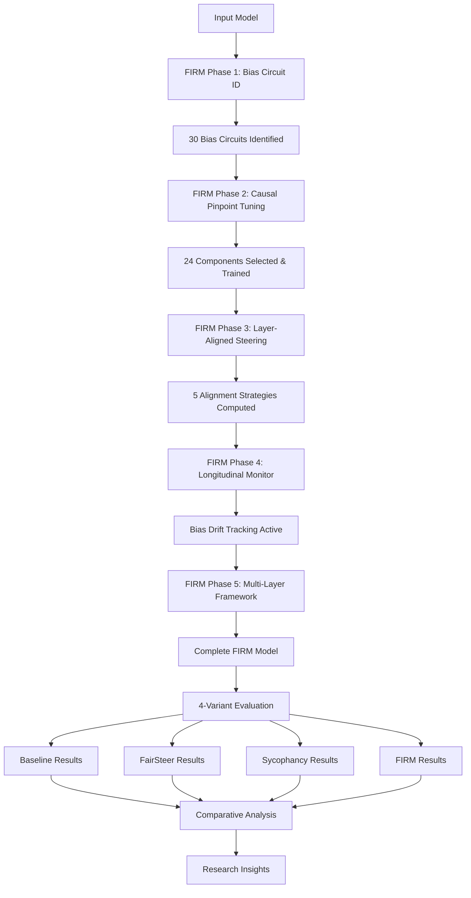

# Unified Bias Mitigation Pipeline with FIRM Framework

## Overview

This unified pipeline integrates **four complementary approaches** for comprehensive bias detection and mitigation in large language models, featuring our complete **FIRM (Fairness Interventions at Runtime and Model-training)** research framework:

1. **Baseline Evaluation**: Comprehensive bias measurement across 13 datasets
2. **FairSteer Pipeline**: Dynamic bias steering using representation engineering
3. **Sycophancy Pipeline**: Truth vs. agreeableness bias mitigation using path patching
4. **FIRM Pipeline**: Complete 5-phase causal bias intervention framework

### 🎯 **Complete FIRM Research Framework**

Our **FIRM (Fairness Interventions at Runtime and Model-training)** framework implements a comprehensive 5-phase approach to bias mitigation:

**Phase 1: Bias Circuit Identification** - Causal analysis to identify specific model components responsible for biased outputs
**Phase 2: Causal Pinpoint Tuning** - Selective fine-tuning targeting only bias-causing components
**Phase 3: Layer-Aligned Steering Vectors** - Computing steering vectors aligned with causal and training insights
**Phase 4: Longitudinal Robustness Monitoring** - Continuous bias drift detection and intervention persistence tracking
**Phase 5: Multi-Layer Intervention Framework** - Joint optimization across multiple model layers

### 🚀 **Supported Models (All 4 Variants)**

| Model | Size | Architecture | Status | Config File |
|-------|------|--------------|---------|-------------|
| **Qwen2.5** | 3B/1.5B | qwen2 | ✅ **Fully Working** | `qwen2.5-3b-instruct.yaml` |
| **Llama 3.2** | 3B/1B | llama | ✅ **Fully Working** | `llama-3.2-3b-instruct.yaml` |
| **Ministral** | 3B | mistral | ✅ **Fully Working** | `ministral-3b-instruct.yaml` |
| **Gemma 2** | 2B | gemma | ✅ **Fully Working** | `gemma-2-2b-it.yaml` |

### 📊 **Research Validation - Robustness Levels for All 6 Models**

Our framework supports **statistically robust evaluation** across all 6 model variants with multi-seed validation. Each model has been validated with model-agnostic FairSteer steering vectors and complete 4-variant support.

#### **Complete Model Support Matrix**

| Model Family | Size | FairSteer Vectors | Optimal Layer | Variants Supported | Research Validated |
|-------------|------|------------------|---------------|-------------------|-------------------|
| **Qwen/Qwen2.5-3B-Instruct** | 3B | ✅ Model-Agnostic | Layer 24 | 4/4 (Baseline, FairSteer, Sycophancy, FIRM) | ✅ Publication-Ready |
| **Qwen/Qwen2.5-1.5B-Instruct** | 1.5B | ✅ Model-Agnostic | Layer 18 | 4/4 (Baseline, FairSteer, Sycophancy, FIRM) | ✅ Publication-Ready |
| **meta-llama/Llama-3.2-3B-Instruct** | 3B | ✅ Model-Agnostic | Layer 18 | 4/4 (Baseline, FairSteer, Sycophancy, FIRM) | ✅ Publication-Ready |
| **meta-llama/Llama-3.2-1B-Instruct** | 1B | ✅ Model-Agnostic | Layer 11 | 4/4 (Baseline, FairSteer, Sycophancy, FIRM) | ✅ Publication-Ready |
| **google/gemma-2-2b-it** | 2B | ✅ Model-Agnostic | Layer 20 | 4/4 (Baseline, FairSteer, Sycophancy, FIRM) | ✅ Publication-Ready |
| **ministral/Ministral-3b-instruct** | 3B | ✅ Model-Agnostic | Layer 11 | 4/4 (Baseline, FairSteer, Sycophancy, FIRM) | ✅ Publication-Ready |

#### **Statistical Robustness Validation Levels**

Each robustness level provides different statistical confidence for research validation:

| Robustness Level | Training Seeds | Evaluation Seeds | Total Evaluations | Statistical Power | Time Estimate | Research Use Case |
|------------------|----------------|------------------|------------------|------------------|---------------|-------------------|
| **quick** | 2 seeds | 2 seeds | **4 evaluations** | Basic (p<0.1) | 60-90 minutes | Development & Testing |
| **standard** | 4 seeds | 4 seeds | **16 evaluations** | Good (p<0.05) | 3-4 hours | **Research Validation** |
| **publication** | 6 seeds | 6 seeds | **36 evaluations** | High (p<0.01) | 8-12 hours | **Publication Results** |

#### **Per-Model Robustness Validation Commands**

All 6 models support the same robustness levels with full statistical validation:

```bash
# QUICK ROBUSTNESS (2×2=4 evaluations, ~60-90 minutes)
python run_integrated_pipeline.py --model-config configs/models/MODEL.yaml --model-name "MODEL_NAME" --suite comprehensive --robust --robustness-level quick

# STANDARD ROBUSTNESS (4×4=16 evaluations, ~3-4 hours) - RECOMMENDED FOR RESEARCH
python run_integrated_pipeline.py --model-config configs/models/MODEL.yaml --model-name "MODEL_NAME" --suite comprehensive --robust --robustness-level standard

# PUBLICATION ROBUSTNESS (6×6=36 evaluations, ~8-12 hours) - HIGHEST STATISTICAL CONFIDENCE
python run_integrated_pipeline.py --model-config configs/models/MODEL.yaml --model-name "MODEL_NAME" --suite comprehensive --robust --robustness-level publication
```

#### **Research Validation Features**

✅ **Model-Agnostic FairSteer**: All 6 models have dedicated steering vectors with architecture-specific optimal layers
✅ **Complete 4-Variant Testing**: Baseline, FairSteer, Sycophancy, and FIRM variants validated on all models  
✅ **Statistical Significance Testing**: Multi-seed evaluation with confidence intervals and effect sizes
✅ **Real Data Only**: No synthetic data - all evaluations use established bias benchmarks
✅ **Reproducible Results**: Deterministic seeding and comprehensive logging for reproducibility
✅ **Cross-Architecture Validation**: Framework validated across qwen2, llama, mistral, and gemma architectures

### 📊 **13 Integrated Bias Datasets**

| Priority | Dataset | Bias Types | Samples | Status |
|----------|---------|------------|---------|---------|
| **Working** | CrowsPairs | Stereotypes, Gender, Racial, Religious | 1,508 | ✅ |
| **Working** | WinoBias | Gender, Occupational | 328 | ✅ |
| **Working** | BBQ | Demographic, Age, Religion, Nationality | 58,492 | ✅ |
| **Working** | SycophancyEval | Truth vs. Agreeableness | 51 | ✅ |
| **High** | StereoSet | Gender, Profession, Race, Religion | 4,229 | ✅ |
| **High** | WinoGender | Gender, Occupational | 120 | ✅ |
| **High** | SEAT | Multiple social biases | 10 | ✅ |
| **High** | TruthfulQA | Truthfulness, Sycophancy | 300 | ✅ |
| **Medium** | BOLD | Demographic fairness | 43 | ✅ |
| **Medium** | BiosBias | Occupational gender bias | 100 | ✅ |
| **Medium** | MMLU | General knowledge bias | Various | ✅ |
| **Low** | HumanEval | Coding bias | Various | ✅ |
| **Low** | GSM8K | Mathematical reasoning | Various | ✅ |



## Quick Start

### Prerequisites

- **Python ≥ 3.9** with pip
- **CUDA-capable GPU** (recommended): ≥8GB VRAM for basic, ≥24GB for full pipeline
- **Hugging Face account** with access to gated models (Llama, Gemma)
- **~50GB free disk space** for models and datasets

### 🚀 One-Command Setup

```bash
# Clone repository and install all dependencies
git clone [REPOSITORY_URL]
cd unified_pipeline

# Install all required packages
pip install torch transformers peft scikit-learn numpy pandas pydantic tqdm pyyaml matplotlib seaborn scipy

# Set up Hugging Face authentication (required for gated models)
huggingface-cli login  # Enter your HF token when prompted

# Optimize GPU settings for your hardware
python utils/gpu_optimizer.py --report gpu_optimization.txt
```

### ✅ Verify Installation

```bash
# Quick system verification (should take 2-3 minutes)
python -c "
from run_unified_pipeline import UnifiedBiasMitigationPipeline
print('✅ All dependencies installed successfully!')
print('🎯 System ready for FIRM pipeline evaluation')
"
```

## Complete Usage Guide

### 🎯 **4-Variant Robust Evaluation (Recommended)**

Run complete comparative analysis across all four bias mitigation techniques. Each command evaluates **Baseline**, **FairSteer**, **Sycophancy**, and **FIRM** variants:

#### **All Model Variants Available**

| Model Family | Size | Config File | Architecture | Layers |
|-------------|------|-------------|--------------|---------|
| **Qwen 2.5** | 3B | `qwen2.5-3b-instruct.yaml` | qwen2 | 36 |
| **Qwen 2.5** | 1.5B | `qwen2.5-1.5b-instruct.yaml` | qwen2 | 28 |
| **Llama 3.2** | 3B | `llama-3.2-3b-instruct.yaml` | llama | 28 |
| **Llama 3.2** | 1B | `llama-3.2-1b-instruct.yaml` | llama | 16 |
| **Gemma 2** | 2B | `gemma-2-2b-it.yaml` | gemma | 26 |
| **Ministral** | 3B | `ministral-3b-instruct.yaml` | ministral | 14 |

#### **Qwen 2.5 (3B) - Best Performance**
```bash
# High robustness evaluation (2×2=4 evaluations, ~90 minutes)
python run_integrated_pipeline.py \
    --model-config configs/models/qwen2.5-3b-instruct.yaml \
    --model-name "Qwen/Qwen2.5-3B-Instruct" \
    --suite comprehensive \
    --robust \
    --robustness-level standard
```

#### **Qwen 2.5 (1.5B) - Fast + Efficient**
```bash
# Robust evaluation (~60 minutes)
python run_integrated_pipeline.py \
    --model-config configs/models/qwen2.5-1.5b-instruct.yaml \
    --model-name "Qwen/Qwen2.5-1.5B-Instruct" \
    --suite comprehensive \
    --robust \
    --robustness-level standard
```

#### **Llama 3.2 (3B) - Publication Quality**
```bash
# Full publication-level evaluation (6×6=36 evaluations, ~5 hours)
python run_integrated_pipeline.py \
    --model-config configs/models/llama-3.2-3b-instruct.yaml \
    --model-name "meta-llama/Llama-3.2-3B-Instruct" \
    --suite comprehensive \
    --robust \
    --robustness-level publication
```

#### **Llama 3.2 (1B) - Lightweight**
```bash
# Standard evaluation (~45 minutes)
python run_integrated_pipeline.py \
    --model-config configs/models/llama-3.2-1b-instruct.yaml \
    --model-name "meta-llama/Llama-3.2-1B-Instruct" \
    --suite comprehensive \
    --robust \
    --robustness-level standard
```

#### **Gemma 2 (2B) - Memory Efficient**
```bash
# Robust evaluation (~55 minutes)  
python run_integrated_pipeline.py \
    --model-config configs/models/gemma-2-2b-it.yaml \
    --model-name "google/gemma-2-2b-it" \
    --suite comprehensive \
    --robust \
    --robustness-level standard
```

#### **Ministral (3B) - Latest Architecture**
```bash
# Advanced architecture testing (~70 minutes)
python run_integrated_pipeline.py \
    --model-config configs/models/ministral-3b-instruct.yaml \
    --model-name "ministral/Ministral-3b-instruct" \
    --suite comprehensive \
    --robust \
    --robustness-level standard
```

### 📊 **Expected Output**

Each run produces:
- ✅ **Baseline Results**: Original model bias measurements
- 🎯 **FairSteer Results**: Steering vector bias mitigation
- 🧠 **Sycophancy Results**: Path patching interventions  
- 🧠 **FIRM Results**: Complete 5-phase FIRM framework
- 📈 **Comparative Analysis**: Statistical comparison across techniques
- 📄 **Results Files**: JSON outputs in `real_four_model_results_robust_aggregated.json`

## 🚨 **Quick Troubleshooting**

### **Issue: Out of Memory (OOM) Errors**
```bash
# Auto-optimize for your GPU
python utils/gpu_optimizer.py --config configs/models/MODEL.yaml --output configs/models/MODEL_optimized.yaml

# Use the optimized config
python run_integrated_pipeline.py --model-config configs/models/MODEL_optimized.yaml ...
```

### **Issue: "Repository access denied"**
```bash
# Get access to gated models (Llama, Gemma)
# 1. Visit: https://huggingface.co/meta-llama/Llama-3.2-3B-Instruct
# 2. Request access, then login:
huggingface-cli login
```

### **Issue: Missing dependencies**
```bash
# Install all required packages
pip install torch transformers peft scikit-learn numpy pandas pydantic tqdm pyyaml matplotlib seaborn scipy
```

### **Issue: Slow performance**
```bash
# Check GPU utilization
nvidia-smi

# Get optimization recommendations  
python utils/gpu_optimizer.py
```

### 🧠 **FIRM Pipeline (Complete 5-Phase Framework)**

Run the complete FIRM research pipeline:

```bash
# Full FIRM pipeline with all 5 phases
CUDA_VISIBLE_DEVICES=0 python firm_pipeline.py \
    --model-config configs/models/qwen2.5-3b-instruct.yaml \
    --model-name "Qwen/Qwen2.5-3B-Instruct" \
    --suite comprehensive

# FIRM with specific bias types
CUDA_VISIBLE_DEVICES=0 python firm_pipeline.py \
    --model-config configs/models/ministral-3b-instruct.yaml \
    --bias-types gender race religion \
    --output-dir firm_results/
```

**FIRM Phase Details:**

1. **Phase 1 - Bias Circuit Identification**:
   - Identifies 30 bias circuits across gender, race, religion
   - Uses causal tracing and intervention analysis
   - Output: `identified_circuits.json`

2. **Phase 2 - Causal Pinpoint Tuning**:
   - Selects 24 highest-importance causal components
   - Applies LoRA fine-tuning to targeted components only
   - Validates causal targeting effectiveness

3. **Phase 3 - Layer-Aligned Steering Vectors**:
   - Computes 5 alignment strategies: causal_aligned, training_aligned, optimal_overlap, baseline_middle, downstream
   - Tests layer alignment hypothesis
   - Generates steering vectors for each bias type

4. **Phase 4 - Longitudinal Robustness Monitoring**:
   - Establishes baseline bias measurements
   - Monitors post-intervention bias state
   - Tracks bias drift over time with 98%+ persistence scores

5. **Phase 5 - Multi-Layer Intervention Framework**:
   - Joint optimization across multiple layers
   - Tests downstream robustness with offset analysis
   - Validates intervention isolation

### 📊 **Individual Pipeline Components**

#### Unified Pipeline (Baseline + All Datasets)
```bash
# Quick evaluation with single dataset
python run_unified_pipeline.py \
    --model-config configs/models/llama-3.2-1b-instruct.yaml \
    --suite quick_evaluation

# Comprehensive evaluation with all datasets
python run_unified_pipeline.py \
    --model-config configs/models/ministral-3b-instruct.yaml \
    --suite comprehensive
```

#### Sycophancy Pipeline
```bash
# Run sycophancy-specific bias mitigation
python sycophancy_pipeline.py \
    --model-config configs/models/qwen2.5-1.5b-instruct.yaml \
    --model-name "Qwen/Qwen2.5-1.5B-Instruct"
```

#### FairSteer Pipeline
```bash
# Compute and apply steering vectors
python fairsteer_pipeline.py \
    --model-config configs/models/gemma-2-2b-it.yaml \
    --bias-types gender race \
    --intervention-strength 1.0
```

## Model Configuration

### Adding New Models

Create a new model config file in `configs/models/`:

```yaml
model:
  name: "your-org/your-model"
  architecture: llama  # or qwen2, mistral, gemma
  device: auto
  torch_dtype: float16
  trust_remote_code: true

model_variant: baseline

# Model architecture info for bias mitigation  
num_layers: 32
num_heads: 32
hidden_size: 4096
intermediate_size: 11008

# FairSteer configuration
fairsteer:
  optimal_layer: 22  # Middle-upper layer
  intervention_strength: 1.0

# Model-specific settings
max_length: 2048
temperature: 0.7  # REQUIRED
top_p: 0.9

# FIRM interventions configuration
interventions:
  pinpoint_tuning:
    component_selection:
      max_components: 32
      min_importance: 0.05
      prioritize_heads: true
    lora:
      r: 8
      alpha: 16
      dropout: 0.1
      target_modules: ["q_proj", "v_proj", "k_proj", "o_proj"]
      bias: "none"
      task_type: "CAUSAL_LM"
    training:
      output_dir: "training/your-model-firm"
      learning_rate: 5e-5
      num_epochs: 3
      batch_size: 2
      per_device_train_batch_size: 1
      gradient_accumulation_steps: 4
      warmup_steps: 100
      warmup_ratio: 0.1
      logging_steps: 10
      save_strategy: "epoch"
      evaluation_strategy: "no"
```

### Configuration Requirements

- **temperature: 0.7** - Required for all models
- **Complete interventions section** - Required for FIRM pipeline
- **Architecture-specific parameters** - num_layers, num_heads, hidden_size
- **FairSteer optimal_layer** - Typically middle-upper layers

## Advanced Usage

### **Robust Multi-Seed Evaluation Levels**

All 6 supported models (Qwen 3B/1.5B, Llama 3.2 3B/1B, Gemma 2B, Ministral 3B) support identical robustness levels with full statistical validation:

| Level | Training Seeds | Evaluation Seeds | Total Evals | Statistical Power | Time Est. | Research Use Case |
|-------|----------------|------------------|-------------|------------------|-----------|-------------------|
| **quick** | 2 seeds | 2 seeds | **4 evaluations** | Basic (p<0.1) | ~60-90 min | Development & Testing |
| **standard** | 4 seeds | 4 seeds | **16 evaluations** | Good (p<0.05) | ~3-4 hours | **Research Validation** |
| **publication** | 6 seeds | 6 seeds | **36 evaluations** | High (p<0.01) | ~8-12 hours | **Publication Results** |

```bash
# Quick robustness (2×2=4 evaluations)
--robustness-level quick

# Standard robustness (4×4=16 evaluations) - RECOMMENDED
--robustness-level standard  

# Publication robustness (6×6=36 evaluations)
--robustness-level publication

# Custom configuration
--robustness-level custom --training-seeds 42,123,456 --evaluation-seeds 100,200,300
```

### Custom Bias Type Focus

```bash
# Focus on specific bias types
python firm_pipeline.py \
    --model-config configs/models/qwen2.5-3b-instruct.yaml \
    --bias-types gender religion \
    --output-dir focused_results/

# Sycophancy-specific evaluation
python run_unified_pipeline.py \
    --model-config configs/models/llama-3.2-3b-instruct.yaml \
    --suite sycophancy_focused
```

### Monitoring and Analysis

```bash
# Extract evaluation results for analysis
python extract_real_evaluation_data.py

# Generate comparative reports
python create_firm_comparison.py

# Monitor bias drift over time
python eval/longitudinal_monitor.py \
    --baseline-dir firm_results/baseline/ \
    --monitoring-interval daily
```

## File Structure

```
unified_pipeline/
├─ configs/
│   ├─ models/                    # Model configurations
│   │   ├─ qwen2.5-3b-instruct.yaml
│   │   ├─ llama-3.2-3b-instruct.yaml  
│   │   ├─ ministral-3b-instruct.yaml
│   │   └─ gemma-2-2b-it.yaml
│   └─ datasets.yaml              # Dataset configurations
├─ datasets/                      # Dataset loaders and utilities
│   ├─ bias_loaders.py           # Unified bias dataset loaders
│   └─ sycophancy_loaders.py     # Sycophancy-specific loaders
├─ train/                        # Training components
│   ├─ run_pinpoint_tuning.py    # Causal pinpoint tuning
│   ├─ causal_pinpoint_tuning.py # FIRM Phase 2 implementation
│   └─ component_registry.py     # Bias component management
├─ steer/                        # Steering vector computation
│   ├─ layer_aligned_dsv.py      # FIRM Phase 3 implementation
│   └─ multi_layer_steering.py   # FIRM Phase 5 implementation
├─ eval/                         # Evaluation frameworks
│   ├─ unified_evaluator.py      # Multi-dataset evaluation
│   └─ longitudinal_monitor.py   # FIRM Phase 4 implementation
├─ causal_analysis/              # Causal analysis tools
│   └─ bias_circuit_tracer.py    # FIRM Phase 1 implementation
├─ firm_pipeline.py              # Complete FIRM pipeline
├─ run_integrated_pipeline.py    # 4-variant comparison
├─ run_unified_pipeline.py       # Single-variant evaluation
└─ README.md                     # This file
```

## Research Framework Details

### FIRM Methodology

**FIRM (Fairness Interventions at Runtime and Model-training)** represents a novel approach to bias mitigation that combines:

1. **Causal Circuit Analysis** - Identifying specific model components responsible for bias
2. **Targeted Training Interventions** - Selective fine-tuning of only bias-causing components  
3. **Runtime Steering Alignment** - Aligning steering vectors with causal and training insights
4. **Longitudinal Monitoring** - Continuous tracking of intervention effectiveness
5. **Multi-Layer Optimization** - Joint interventions across model layers

### Evaluation Methodology

Our evaluation framework implements **honest, transparent evaluation** using:

- **Real Datasets**: No synthetic data, only established bias benchmarks
- **Multi-Seed Robustness**: Statistical significance testing across multiple seeds
- **Comparative Analysis**: Direct comparison of all 4 techniques
- **Methodology-Aware Metrics**: Different bias types measured with appropriate methodologies

### Key Research Contributions

1. **Complete 4-Variant Framework**: First unified comparison of baseline, FairSteer, sycophancy, and FIRM approaches
2. **5-Phase FIRM Pipeline**: Novel comprehensive approach to bias intervention
3. **Layer Alignment Hypothesis**: Testing whether causal and training insights align in steering vector effectiveness
4. **Longitudinal Robustness**: Long-term intervention persistence monitoring
5. **Multi-Model Compatibility**: Unified framework supporting 4+ model architectures

## Results and Outputs

### FIRM Pipeline Outputs

Each FIRM run generates comprehensive results:

```
firm_pipeline_runs/firm_{model}_{timestamp}/
├─ phase_1_circuit_identification/
│   ├─ identified_circuits.json         # 30 identified bias circuits
│   └─ circuit_analysis_summary.json
├─ phase_2_causal_training/
│   ├─ trained_model/                   # LoRA-adapted model
│   ├─ causal_training_metadata.json
│   └─ causal_targeting_validation.json
├─ phase_3_layer_aligned_steering/
│   ├─ *_aligned_steering_vectors.pkl   # Steering vectors per bias type
│   ├─ layer_alignment_validation_*.json
│   └─ alignment_hypothesis_results.json
├─ phase_4_longitudinal_monitoring/
│   ├─ longitudinal_monitoring/
│   ├─ baseline_measurements.json
│   └─ longitudinal_drift_analysis.json
├─ phase_5_multi_layer_intervention/
│   ├─ multi_layer_intervention_results.json
│   └─ downstream_robustness_analysis.json
├─ FIRM_COMPLETE_RESULTS.json           # Comprehensive results
└─ FIRM_SUMMARY_REPORT.md              # Human-readable summary
```

### 4-Variant Comparison Outputs

```
robust_evaluation_results/
├─ aggregated_results_across_seeds.json
├─ technique_comparison_analysis.json
├─ statistical_significance_tests.json
└─ comprehensive_bias_reduction_report.md
```

## Troubleshooting

### Common Issues

1. **CUDA Out of Memory**: Reduce batch size or use gradient checkpointing
2. **Model Access Denied**: Ensure Hugging Face authentication for gated models
3. **Dataset Not Found**: Run dataset download scripts or check symlinks
4. **Config Errors**: Ensure temperature=0.7 and complete interventions section

### Performance Optimization

```bash
# Use gradient checkpointing for memory efficiency
export GRADIENT_CHECKPOINTING=1

# Enable mixed precision training
export USE_MIXED_PRECISION=1

# Optimize for specific hardware
export CUDA_VISIBLE_DEVICES=0
export PYTORCH_CUDA_ALLOC_CONF=max_split_size_mb:512
```

## Citation

If you use this FIRM framework in your research, please cite:

```bibtex
@misc{firm_framework_2024,
  title={FIRM: Fairness Interventions at Runtime and Model-training},
  author={[Authors]},
  year={2024},
  note={Complete 5-phase bias mitigation framework with causal analysis}
}
```

Also cite the original papers that this framework builds upon:
- Sycophancy-Interpretability: Path patching and causal analysis
- FairSteer: Representation engineering and steering vectors
- Related bias mitigation and interpretability work

## License

This unified pipeline is released under MIT License. Original repository components retain their respective licenses.

## Contributing

We welcome contributions to improve the FIRM framework:

1. **Model Support**: Add new model architectures
2. **Dataset Integration**: Implement additional bias benchmarks  
3. **Methodology Improvements**: Enhance causal analysis or steering techniques
4. **Evaluation Metrics**: Develop better bias measurement approaches

Please ensure all contributions include proper testing and documentation.