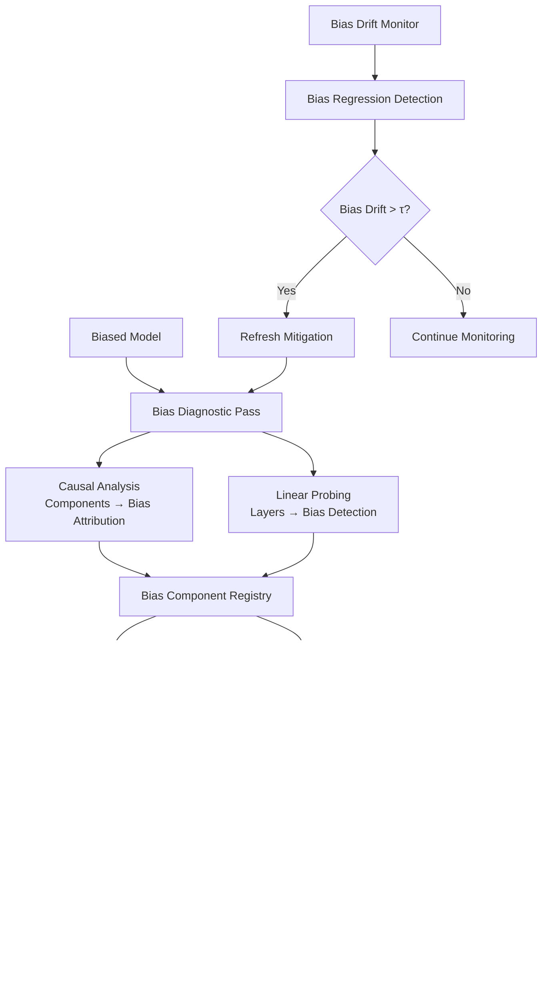

# Unified Bias Mitigation Pipeline

## Overview

This unified pipeline combines two complementary approaches for comprehensive bias detection and mitigation in large language models:

1. **Causal Bias Localization** (Training-time): Selective fine-tuning of model components identified via interpretability techniques as responsible for biased outputs
2. **Dynamic Bias Steering** (Inference-time): Real-time bias detection and correction using linear steering vectors applied during generation



## Quick Start

### Prerequisites

- Python ≥ 3.9
- PyTorch with CUDA support (recommended)
- Required packages: `transformers`, `huggingface_hub`, `peft`, `scikit-learn`, `numpy`, `pandas`, `pydantic`, `tqdm`

### Installation

1. Install dependencies:
```bash
pip install torch transformers peft scikit-learn numpy pandas pydantic tqdm yaml
```

2. Set up data symlinks (if using existing datasets):
```bash
# The pipeline will create these automatically, but you can set them up manually
ln -s ../datasets/bbq/data data/bbq_data
ln -s ../datasets/winobias data/winobias_data
ln -s ../sycophancy-interpretability/evaluation/datasets/sycophancy_eval data/sycophancy_data
```
Note: rename sycophancy-interpretability to sycophancy_interpretability 

### Running the Complete Bias Mitigation Pipeline

The easiest way to run the entire bias mitigation pipeline is using the unified runner:

```bash
# Run with full bias mitigation (causal debiasing + dynamic steering)
python run_full_pipeline.py --config configs/full.yaml --dataset_size 500

# Run baseline bias measurement only
python run_full_pipeline.py --config configs/baseline.yaml --dataset_size 300

# Run with dynamic bias steering only (no model retraining)
python run_full_pipeline.py --config configs/steer.yaml --dataset_size 400
```

### Step-by-Step Execution

If you prefer to run components separately:

#### 1. Bias Diagnostic Pass
```bash
python eval/run_diagnostic.py \
    --config configs/full.yaml \
    --data_path data/bias_diagnostic_dataset.jsonl \
    --output_dir diagnostics/
```

#### 2. Causal Bias Mitigation (Optional)
```bash
python train/run_bias_mitigation.py \
    --config configs/pinpoint.yaml \
    --registry diagnostics/bias_component_registry.json \
    --output_dir models/debiased/
```

#### 3. Dynamic Steering Vectors (Optional)
```bash
python steer/compute_bias_steering.py \
    --config configs/steer.yaml \
    --registry diagnostics/bias_component_registry.json \
    --output_dir steering/ \
    --num_pairs 1000
```

#### 4. Bias Evaluation
```bash
python eval/run_benchmark.py \
    --config configs/full.yaml \
    --model_path models/debiased/ \
    --diagnostic_dir diagnostics/ \
    --output_dir results/
```

### Bias Monitoring (Optional)

Set up continuous bias monitoring to detect regression:

```bash
# Establish baseline bias metrics
python nightly/bias_drift_monitor.py \
    --config configs/full.yaml \
    --action establish_baseline

# Check for bias regression
python nightly/bias_drift_monitor.py \
    --config configs/full.yaml \
    --action check_drift

# Generate bias monitoring report
python nightly/bias_drift_monitor.py \
    --config configs/full.yaml \
    --action generate_report \
    --days_back 7
```

Set up automated bias monitoring with cron:
```bash
# Copy and modify the cron template
cp nightly/cron_template.sh /usr/local/bin/bias_monitor.sh
chmod +x /usr/local/bin/bias_monitor.sh

# Add to crontab (runs daily at 2 AM)
echo "0 2 * * * /usr/local/bin/bias_monitor.sh" | crontab -
```

## Architecture Mapping

### Integration Plan

#### 1. Unified Bias Diagnostic Pass (`eval/run_diagnostic.py`)
- **Input**: Model + bias evaluation datasets (demographic, gender, racial, religious bias)
- **Causal Analysis Component**: 
  - Identifies attention heads and MLP layers responsible for biased outputs
  - Uses intervention-based causality analysis (adapted from path-patching)
- **Linear Probing Component**:
  - Trains bias detection classifiers on internal activations
  - Builds BAD (Biased Activation Detection) probes for runtime bias detection
- **Output**: `diagnostics/{model}/{timestamp}.json` with bias component rankings

#### 2. Bias Component Registry (`train/bias_component_registry.json`)
- **Format**: `{"layer": int, "type": "head|mlp", "importance": float, "bias_type": "gender|racial|religious|general"}`
- **Sources**: 
  - High-impact components from causal analysis (bias-causing heads/layers)
  - High-accuracy layers from BAD probes (bias-detectable layers)
- **Usage**: Read by both selective debiasing training and steering vector computation

#### 3. Selective Bias Mitigation Training (`train/run_bias_mitigation.py`)
- **Base**: Selective fine-tuning framework adapted for bias mitigation
- **Enhancement**: Read bias component registry to determine which model components to debias
- **Data**: Bias counterfactual datasets (demographic fairness + stereotype reduction)
- **Output**: Debiased model with selective parameter updates targeting only bias-causing components

#### 4. Dynamic Bias Mitigation Wrapper (`steer/bias_steering_wrapper.py`)
- **Base**: Real-time bias detection and correction system
- **Logic**: 
  ```python
  def forward_hook(self, module, input, output):
      bias_prob = self.bias_detector.predict(activations)
      if bias_prob < 0.5:
          return output  # No bias detected
      else:
          return output + self.debiasing_vector  # Apply bias correction
  ```
- **Integration**: Compatible with HuggingFace `generate()` via forward hooks for seamless bias mitigation

#### 5. Comprehensive Bias Evaluation (`eval/run_bias_benchmark.py`)
- **Datasets**: Comprehensive bias benchmarks (BBQ, WinoBias, CrowS-Pairs, StereoSet, BOLD)
- **Metrics**: Track bias reduction, fairness metrics, demographic parity before/after each intervention
- **Configs**: Support `--config configs/full.yaml` for multi-stage bias evaluation

#### 6. Bias Regression Monitoring (`nightly/bias_drift_monitor.py`)
- **Bias Detection Refresh**: Re-run bias detection probes on canary dataset
- **Causal Analysis Check**: Fast bias causality check on stored bias examples
- **Triggers**: If bias regression > threshold, auto-refresh debiasing interventions

## File Structure Details

```
unified_pipeline/
├─ configs/
│   ├─ baseline.yaml          # Raw model, no interventions
│   ├─ pinpoint.yaml          # Training-time only
│   ├─ steer.yaml             # Inference-time only
│   └─ full.yaml              # Both tiers enabled
├─ data/
│   └─ (symlinks to existing sycophancy + bias datasets)
├─ train/
│   ├─ run_pinpoint_tuning.py # Adapted from sycophancy-interpretability
│   ├─ utils.py               # Shared training utilities
│   └─ component_registry.json # Generated by diagnostic pass
├─ steer/
│   ├─ compute_dsv.py         # Builds steering vectors
│   ├─ run_bad_training.py    # Trains bias detection probes
│   └─ das_wrapper.py         # Runtime activation steering
├─ eval/
│   ├─ run_diagnostic.py      # Unified path patching + BAD
│   ├─ run_benchmark.py       # Multi-dataset evaluation
│   └─ metrics.py             # Unified metrics computation
├─ nightly/
│   ├─ drift_monitor.py       # Automated drift detection
│   └─ cron_template.sh       # Scheduling template
└─ README.md                  # This file
```

## Integration Logic Details

### Component Registry Schema
```json
{
  "model_name": "meta-llama/Llama-2-7b-chat-hf",
  "timestamp": "2024-01-01T00:00:00Z",
  "components": [
    {
      "layer": 12,
      "type": "head", 
      "head_index": 8,
      "importance": 0.85,
      "bias_type": "sycophancy",
      "source": "path_patching"
    },
    {
      "layer": 14,
      "type": "mlp",
      "importance": 0.72,
      "bias_type": "demographic",
      "source": "bad_probe"
    }
  ]
}
```

### Data Flow Integration
1. **Diagnostic Pass**: Single expensive forward pass stores activations
2. **Path Patching**: Consumes stored activations for causal analysis
3. **BAD Training**: Uses same activations for bias probe training
4. **Registry Generation**: Merges both analyses into unified component list
5. **Pinpoint Tuning**: Reads registry to select LoRA targets
6. **DSV Computation**: Uses BAD results to build steering vectors
7. **Runtime Wrapper**: Combines fine-tuned model + dynamic steering

### Resume & Logging Framework
- Extend existing sycophancy-interpretability skip/resume logic
- Add checkpoints for: diagnostic pass, registry creation, DSV computation
- Unified logging format compatible with both repositories

## Research Purpose & Citation

This unified pipeline is designed for research into:
- Multi-tier bias mitigation strategies
- Causal interpretability of model bias
- Sustainable fairness interventions
- Drift monitoring and automatic correction

Please cite both original papers when using this code:
- Sycophancy-Interpretability: [paper link]
- Fairsteer: [paper link]

## License

New code in this unified_pipeline/ directory is released under MIT License.
Original repository code retains their respective licenses.
